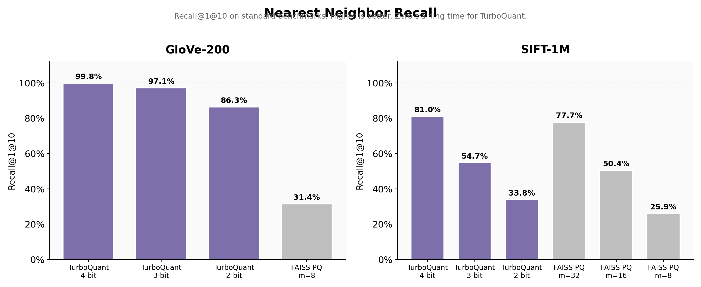
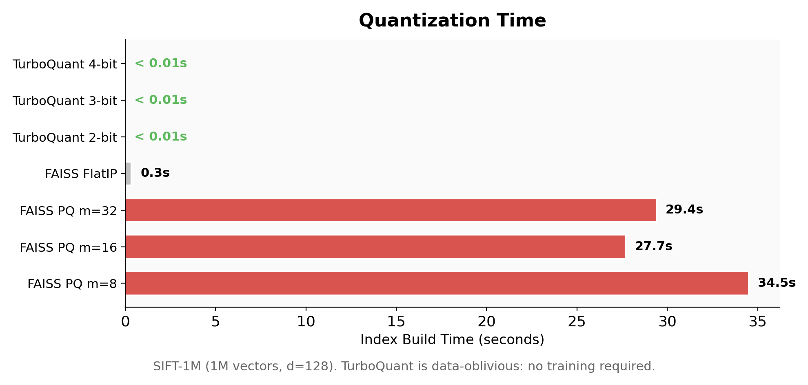
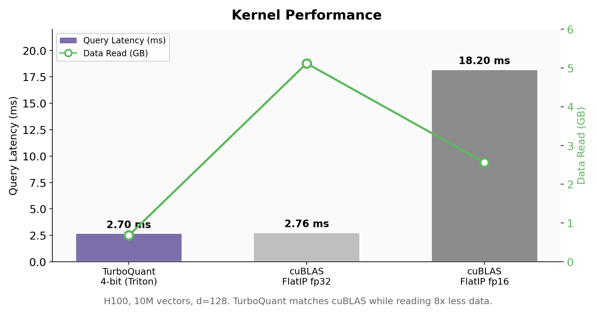
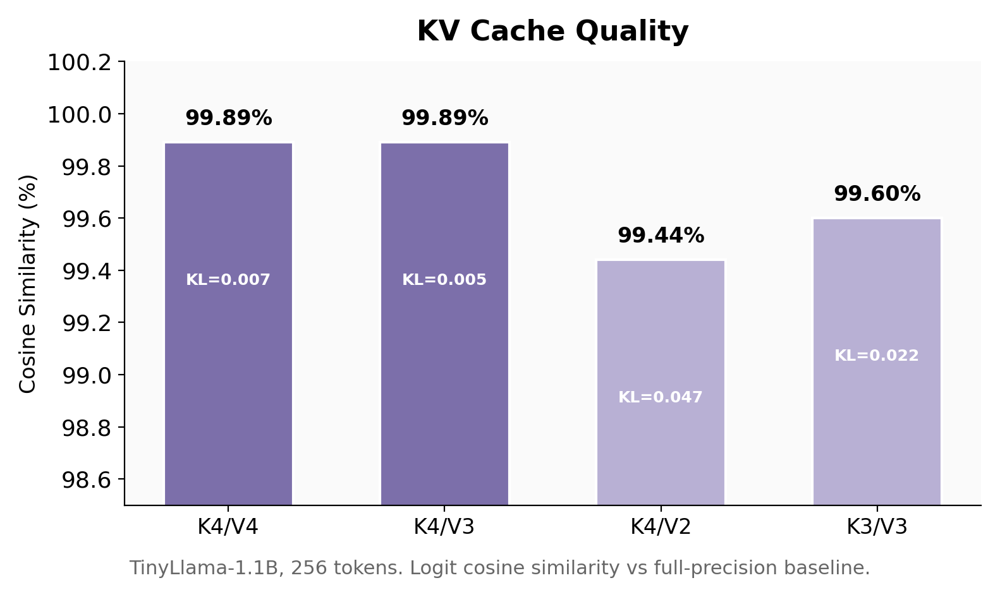

<p align="center">
  <h1 align="center">turboquant-kv</h1>
  <p align="center">Near-optimal vector quantization for KV cache compression and similarity search.<br>
  Based on <a href="https://arxiv.org/abs/2504.19874">TurboQuant</a> (Google Research, 2025).</p>
</p>

<p align="center">
  <a href="#installation">Installation</a> &bull;
  <a href="#benchmarks">Benchmarks</a> &bull;
  <a href="#quick-start">Quick Start</a> &bull;
  <a href="#how-it-works">How It Works</a> &bull;
  <a href="#citation">Citation</a>
</p>

## Why TurboQuant

TurboQuant is a data-oblivious quantizer that achieves provably near-optimal distortion (within 2.7x of the Shannon bound) with zero training time. It consistently outperforms FAISS Product Quantization on recall while eliminating the expensive k-means training step entirely.

This package provides:
- A paper-exact reference implementation with verified distortion bounds
- Optimized Triton kernels that match cuBLAS throughput at 8x compression
- A C++ core with pybind11 bindings (no PyTorch dependency)
- Drop-in KV cache for HuggingFace Transformers and vLLM

## Benchmarks

### Nearest Neighbor Recall

Evaluated on GloVe-200 (390K word embeddings, Stanford NLP) and SIFT-1M (1M image descriptors, INRIA).

<p align="center">
  
</p>

| Method | GloVe-200 | SIFT-1M | Bits/dim | Training |
|--------|-----------|---------|---------|---------|
| **TurboQuant 4-bit** | **99.8%** | **81.0%** | 4 | **None** |
| **TurboQuant 3-bit** | **97.1%** | **54.7%** | 3 | **None** |
| **TurboQuant 2-bit** | **86.3%** | **33.8%** | 2 | **None** |
| FAISS PQ m=32 | n/a | 77.7% | 2 | 29s |
| FAISS PQ m=16 | n/a | 50.4% | 1 | 28s |
| FAISS PQ m=8 | 31.4% | 25.9% | 0.5 | 35s |

At comparable bits per dimension, TurboQuant matches or exceeds FAISS PQ with no training.

### Quantization Time

<p align="center">
  
</p>

### Kernel Performance

Measured on H100, 10M vectors, d=128.

<p align="center">
  
</p>

The Triton kernel matches cuBLAS FlatIP throughput while reading 8x less data from memory.

### KV Cache Quality

Logit cosine similarity vs full-precision baseline on TinyLlama-1.1B (256 tokens).

<p align="center">
  
</p>

All configurations maintain >99.4% cosine similarity with the uncompressed model. Top-1 token agreement is 100% across all tested bit widths.

## Installation

```bash
pip install turboquant-kv
```

Build from source (enables Triton and C++ acceleration):

```bash
git clone https://github.com/ansschh/turboquant-kv.git
cd turboquant-kv
pip install -e .
```

Requires Python 3.9+ and PyTorch 2.0+. Triton is optional (GPU kernels). C++ core builds automatically if pybind11 is available.

## Quick Start

### Vector Search

```python
from turboquant_kv import TurboQuantIndex

index = TurboQuantIndex(dim=128, bit_width=4)
index.add(vectors)  # torch.Tensor [N, 128]

scores, indices = index.search(queries, k=10)
```

### KV Cache Compression

```python
from turboquant_kv.hf_integration import TurboQuantCache

cache = TurboQuantCache(key_bits=4, value_bits=2)
output = model.generate(input_ids, past_key_values=cache, max_new_tokens=100)
```

### Configuration

```python
from turboquant_kv import TurboQuantConfig

config = TurboQuantConfig(
    key_bits=4,              # bits per coordinate for keys
    value_bits=2,            # bits per coordinate for values
    mode="mse",              # "mse" (Algorithm 1) or "prod" (Algorithm 2)
    rotation="dense_qr",     # "dense_qr" (exact) or "rht" (fast Hadamard)
    outlier_channels=32,     # channels quantized at +1 bit
    protected_layers=0,      # first N layers at full precision
)
```

## How It Works

TurboQuant applies a random orthogonal rotation to input vectors, making each coordinate approximately Gaussian regardless of the original distribution. It then quantizes each coordinate independently using a Lloyd-Max codebook optimized for the known post-rotation distribution.

This is fundamentally different from Product Quantization, which splits vectors into subvectors and learns data-dependent codebooks. TurboQuant requires no training and provides provable distortion guarantees.

The package implements both algorithms from the paper:

- **TurboQuantMSE** (Algorithm 1): Minimizes reconstruction MSE. Used for vector search and KV keys.
- **TurboQuantProd** (Algorithm 2): Adds a 1-bit QJL residual correction for unbiased inner product estimation.

## Architecture

```
turboquant_kv/
  reference.py        Paper-exact Algorithm 1 & 2
  cache.py            QuantizedKVCache with packed storage
  search.py           TurboQuantIndex (C++ or Python backend)
  triton_kernels.py   Optimized Triton kernels (2/3/4-bit)
  hf_integration.py   HuggingFace Transformers cache
  distributed.py      Multi-GPU tensor-parallel support
  entropy.py          Huffman coding for 5.9% disk savings
  ops.py              Dispatch: Triton > CUDA > C++ > Python
csrc/
  core/               Standalone C++ with pybind11 bindings
  cuda/               CUDA kernels (rotate, pack, attention)
  cpu/                OpenMP CPU fallbacks
```

## Citation

```bibtex
@article{zandieh2025turboquant,
  title={TurboQuant: Online Vector Quantization with Near-optimal Distortion Rate},
  author={Zandieh, Amir and Daliri, Majid and Hadian, Majid and Mirrokni, Vahab},
  journal={arXiv preprint arXiv:2504.19874},
  year={2025}
}
```

## License

Apache-2.0
