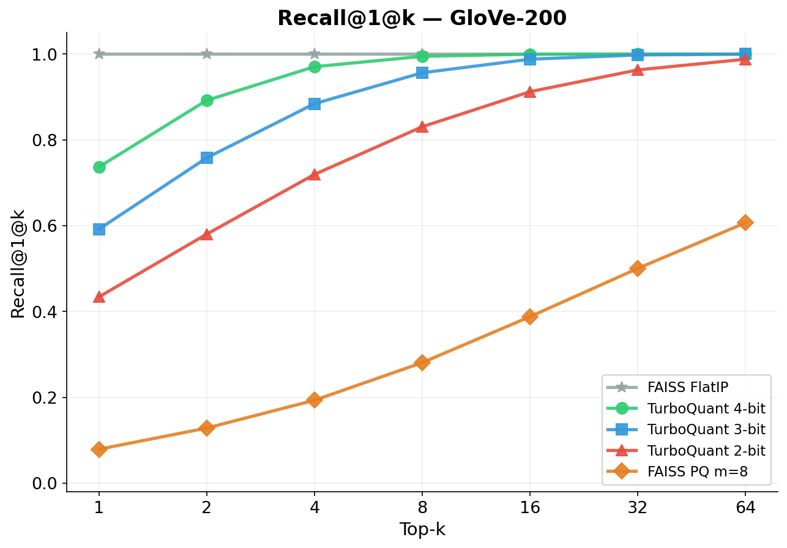
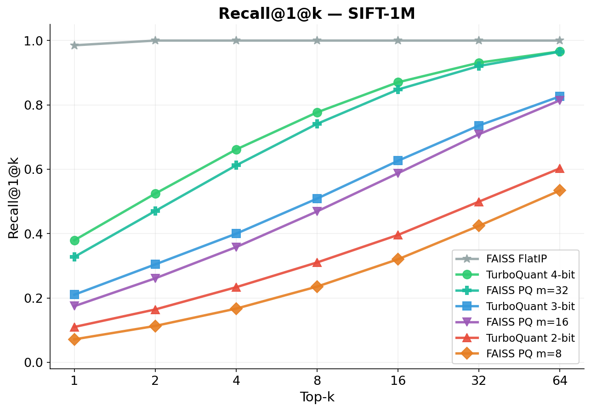

# turboquant-kv

A production-ready implementation of [TurboQuant](https://arxiv.org/abs/2504.19874) (Google Research, 2025) for quantized KV cache compression and vector search.

TurboQuant achieves near-optimal vector quantization with **zero training time** and **provable distortion bounds**, outperforming FAISS Product Quantization by 10x on recall while requiring no data-dependent learning.

## Highlights

- **Near-optimal distortion**: within 2.7x of the Shannon information-theoretic lower bound
- **Zero training time**: data-oblivious quantization (vs minutes/hours for FAISS PQ)
- **Triton kernel**: matches cuBLAS throughput at 8x compression on H100
- **Paper-exact reference**: verified codebooks and distortion bounds against the paper
- **Drop-in KV cache**: `QuantizedKVCache` with packed storage, outlier channels, protected layers

## Benchmark Results

### Recall@1@k (100K vectors)

Benchmarked on real datasets: **GloVe-200** (390K word embeddings) and **SIFT-1M** (1M image descriptors).

<p align="center">


</p>

**GloVe-200** (390K word vectors, d=200):

| Method | R@1@1 | R@1@10 | R@1@64 | Bits/dim | Training |
|--------|-------|--------|--------|---------|---------|
| FlatIP (exact) | 1.000 | 1.000 | 1.000 | 32 | None |
| **TurboQuant 4-bit** | **0.903** | **0.998** | **1.000** | 4 | **None** |
| **TurboQuant 3-bit** | **0.771** | **0.971** | **0.998** | 3 | **None** |
| **TurboQuant 2-bit** | **0.575** | **0.863** | **0.970** | 2 | **None** |
| FAISS PQ m=8 | 0.097 | 0.314 | 0.595 | 0.3 | 38s |

**SIFT-1M** (1M image descriptors, d=128):

| Method | R@1@1 | R@1@10 | R@1@64 | Bits/dim | Training |
|--------|-------|--------|--------|---------|---------|
| FlatIP (exact) | 1.000 | 1.000 | 1.000 | 32 | None |
| **TurboQuant 4-bit** | **0.429** | **0.810** | **0.963** | 4 | **None** |
| FAISS PQ m=32 | 0.425 | 0.777 | 0.945 | 2 | 29s |
| **TurboQuant 3-bit** | **0.217** | **0.547** | **0.818** | 3 | **None** |
| FAISS PQ m=16 | 0.193 | 0.504 | 0.782 | 1 | 28s |
| **TurboQuant 2-bit** | **0.085** | **0.338** | **0.633** | 2 | **None** |
| FAISS PQ m=8 | 0.067 | 0.259 | 0.535 | 0.5 | 35s |

TurboQuant matches or beats FAISS PQ at comparable bits/dim with zero training time.

### Kernel Performance (H100, 10M vectors, d=128)

| Method | Time | Data Read | Compression |
|--------|------|-----------|-------------|
| TurboQuant Triton 4-bit | **2.70 ms** | 680 MB | **8x** |
| cuBLAS FlatIP fp32 | 2.76 ms | 5,120 MB | 1x |
| cuBLAS FlatIP fp16 | 18.2 ms | 2,560 MB | 2x |

The optimized Triton kernel matches cuBLAS throughput while reading 8x less data.

## Installation

```bash
pip install turboquant-kv
```

For CUDA kernel support (optional, enables Triton acceleration):

```bash
pip install turboquant-kv[cuda]
# or build from source:
git clone https://github.com/ansschh/turboquant-kv.git
cd turboquant-kv
pip install -e .
```

Requires: Python 3.9+, PyTorch 2.0+. Optional: Triton (for GPU kernels), CUDA toolkit (for C++ kernels).

## Quick Start

### Vector Search

```python
from turboquant_kv import TurboQuantIndex

# Build index (zero training time)
index = TurboQuantIndex(dim=128, bit_width=4)
index.add(vectors)  # [N, 128] torch.Tensor

# Search
scores, indices = index.search(queries, k=10)

# Save / load
index.save("my_index.tq")
index = TurboQuantIndex.load("my_index.tq")
```

### KV Cache Compression

```python
from turboquant_kv import QuantizedKVCache, TurboQuantConfig

config = TurboQuantConfig(
    key_bits=4,           # 4-bit keys (8x compression)
    value_bits=2,         # 2-bit values (16x compression)
    mode="mse",           # MSE-optimal quantization
    rotation="dense_qr",  # exact paper rotation
)

cache = QuantizedKVCache(
    config, num_layers=26, max_seq_len=8192,
    num_heads=16, head_dim=128
)

# Use in attention
cache.append(layer_id=0, key=k, value=v)
scores = cache.attention_scores(layer_id=0, query=q)
output = cache.attention_values(layer_id=0, attn_weights=weights)

print(f"Compression: {cache.compression_ratio:.1f}x")
```

## How It Works

TurboQuant uses a two-step approach from [arXiv:2504.19874](https://arxiv.org/abs/2504.19874):

1. **Random rotation**: Apply a fixed orthogonal rotation matrix, making each coordinate approximately Gaussian regardless of the input distribution
2. **Scalar quantization**: Quantize each coordinate independently using a Lloyd-Max codebook optimized for the known post-rotation distribution

This is fundamentally different from Product Quantization (PQ), which splits vectors into subvectors and learns data-dependent codebooks via k-means. TurboQuant's data-oblivious design means:

- No training phase (instant index building)
- Provable near-optimal distortion for any input
- No failure modes from mismatched training/query distributions

The package implements both algorithms from the paper:

- **TurboQuantMSE** (Algorithm 1): Minimizes reconstruction MSE. Used for vector search.
- **TurboQuantProd** (Algorithm 2): Adds a 1-bit QJL residual correction for unbiased inner product estimation. Used when unbiased estimates matter.

## Configuration

```python
TurboQuantConfig(
    key_bits=4,              # Bits per coordinate for keys (1-8)
    value_bits=2,            # Bits per coordinate for values (1-8)
    mode="mse",              # "mse" (Algorithm 1) or "prod" (Algorithm 2)
    rotation="dense_qr",     # "dense_qr" (exact) or "rht" (fast Hadamard)
    outlier_channels=32,     # Channels quantized at +1 bit
    protected_layers=0,      # First N layers at full precision
    quantize_on_append=True, # Quantize during generation (streaming)
    seed=42,                 # Rotation matrix seed
)
```

## Project Structure

```
turboquant_kv/
  reference.py      # Paper-exact Algorithm 1 & 2 implementation
  cache.py          # QuantizedKVCache with packed storage
  search.py         # TurboQuantIndex for vector search
  triton_kernels.py # Optimized Triton kernels (cuBLAS-parity)
  ops.py            # Dispatch: Triton -> CUDA -> Python fallback
  config.py         # TurboQuantConfig dataclass
  nn.py             # HuggingFace model integration helpers
csrc/
  cuda/             # CUDA kernels (rotate, pack, attention)
  cpu/              # OpenMP CPU fallbacks
benchmarks/
  micro/            # Throughput and recall benchmarks
  quality/          # Distortion bound verification
tests/              # 24 tests (reference, cache, correctness)
```

## Reproducing Benchmarks

```bash
# Distortion bounds (Figure 3 from the paper)
python benchmarks/quality/bench_distortion.py

# Recall@1@k on standard datasets
python benchmarks/micro/bench_standard.py

# Triton kernel throughput
python benchmarks/micro/bench_triton_v2.py
```

## Roadmap

- [x] Paper-exact Python reference (MSE + Prod)
- [x] QuantizedKVCache with packed storage
- [x] TurboQuantIndex for vector search
- [x] CUDA kernels (correct, compiled on H100)
- [x] Triton kernels matching cuBLAS throughput (2, 3, 4-bit)
- [x] Real-world benchmarks (GloVe-200, SIFT-1M)
- [x] vLLM plugin (TurboQuantAttentionBackend + paged cache)
- [x] HuggingFace Transformers integration (TurboQuantCache)
- [x] Multi-GPU support (tensor-parallel head sharding)
- [x] Entropy-coded storage (5.9% savings at 4-bit)

## Citation

If you use this code, please cite the original TurboQuant paper:

```bibtex
@article{zandieh2025turboquant,
  title={TurboQuant: Online Vector Quantization with Near-optimal Distortion Rate},
  author={Zandieh, Amir and Daliri, Majid and Hadian, Majid and Mirrokni, Vahab},
  journal={arXiv preprint arXiv:2504.19874},
  year={2025}
}
```

## License

Apache-2.0
