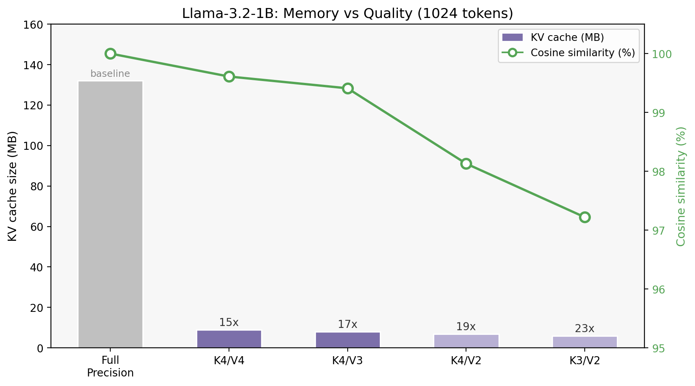
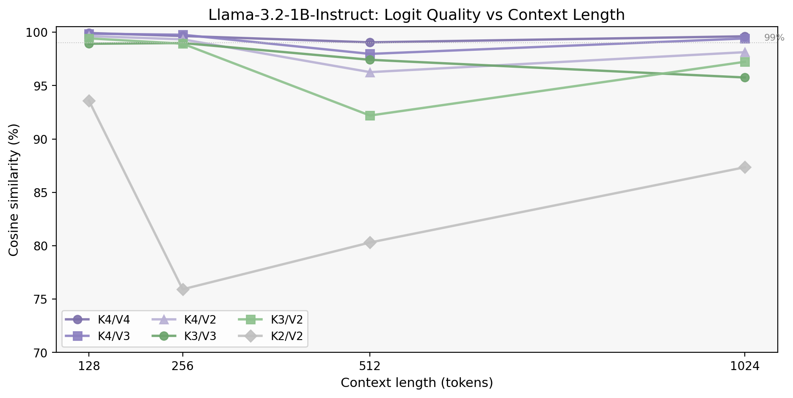

<div align="center">

# turboquant-kv

**Near-optimal vector quantization for KV cache compression and similarity search**

[](https://arxiv.org/abs/2504.19874)
[](LICENSE)
[](https://python.org)
[](https://pytorch.org)

</div>

---

## Overview

`turboquant-kv` implements [TurboQuant](https://arxiv.org/abs/2504.19874) (Google Research, 2025), a data-oblivious quantizer with provable distortion bounds within 2.7x of the Shannon information-theoretic lower bound. It compresses vectors to 2-4 bits per dimension with zero training time, consistently matching or exceeding FAISS Product Quantization on recall.

This package provides a paper-exact reference implementation, optimized Triton kernels that match cuBLAS throughput at 8x compression, a standalone C++ core with pybind11 bindings, and drop-in integration for HuggingFace Transformers and vLLM.

## Benchmarks

### Nearest Neighbor Recall

GloVe-200 (390K vectors, d=200, Stanford NLP) and SIFT-1M (1M vectors, d=128, INRIA).

<p align="center">
  
</p>

| Method | GloVe-200 | SIFT-1M | Bits/dim | Training |
|--------|-----------|---------|---------|----------|
| TurboQuant 4-bit | 99.8% | 81.0% | 4 | None |
| TurboQuant 3-bit | 97.1% | 54.7% | 3 | None |
| TurboQuant 2-bit | 86.3% | 33.8% | 2 | None |
| FAISS PQ m=32 | n/a | 77.7% | 2 | 29s |
| FAISS PQ m=16 | n/a | 50.4% | 1 | 28s |
| FAISS PQ m=8 | 31.4% | 25.9% | 0.5 | 35s |

### Index Build Time

<p align="center">
  
</p>

### Kernel Performance

H100, 10M vectors, d=128.

<p align="center">
  
</p>

The optimized Triton kernel matches cuBLAS FlatIP while reading 8x less data from HBM.

### KV Cache on Llama-3.2-1B-Instruct

Memory vs quality at 1024 tokens. 15x compression with 99.6% cosine similarity.

<p align="center">
  
</p>

Quality across context lengths. K4/V4 and K4/V3 maintain 100% top-1 token agreement up to 1024 tokens.

<p align="center">
  
</p>

| Config | 128 tok | 256 tok | 512 tok | 1024 tok | Top-1 Match |
|--------|---------|---------|---------|----------|-------------|
| K4/V4 | 99.92% | 99.64% | 99.05% | 99.61% | 4/4 |
| K4/V3 | 99.86% | 99.76% | 97.97% | 99.41% | 4/4 |
| K4/V2 | 99.64% | 99.33% | 96.26% | 98.13% | 4/4 |
| K3/V3 | 98.91% | 98.99% | 97.41% | 95.76% | 4/4 |
| K3/V2 | 99.42% | 98.92% | 92.19% | 97.22% | 3/4 |
| K2/V2 | 93.58% | 75.92% | 80.30% | 87.35% | 2/4 |

## Installation

```bash
pip install turboquant-kv
```

From source:

```bash
git clone https://github.com/ansschh/turboquant-kv.git
cd turboquant-kv && pip install -e .
```

## Quick Start

### Vector Search

```python
from turboquant_kv import TurboQuantIndex

index = TurboQuantIndex(dim=128, bit_width=4)
index.add(vectors)
scores, indices = index.search(queries, k=10)
```

### KV Cache

```python
from turboquant_kv.hf_integration import TurboQuantCache

cache = TurboQuantCache(key_bits=4, value_bits=2)
output = model.generate(input_ids, past_key_values=cache, max_new_tokens=100)
```

## How It Works

TurboQuant applies a random orthogonal rotation to input vectors, making each coordinate approximately Gaussian regardless of the original distribution. Each coordinate is then quantized independently using a Lloyd-Max codebook optimized for the known post-rotation distribution. No data-dependent training is needed.

The package implements both algorithms from the paper:

- **TurboQuantMSE** (Algorithm 1): minimizes reconstruction MSE
- **TurboQuantProd** (Algorithm 2): adds a 1-bit QJL residual for unbiased inner product estimation

## Architecture

```
turboquant_kv/
  reference.py        Paper-exact Algorithm 1 & 2
  cache.py            QuantizedKVCache with packed storage
  search.py           TurboQuantIndex (C++ or Python backend)
  triton_kernels.py   Optimized 2/3/4-bit Triton kernels
  hf_integration.py   HuggingFace Transformers cache
  distributed.py      Multi-GPU tensor-parallel support
  entropy.py          Huffman coding (5.9% disk savings at 4-bit)
csrc/
  core/               Standalone C++ with pybind11 (no PyTorch dependency)
  cuda/               CUDA attention kernels
  cpu/                OpenMP fallbacks
```

## Citation

```bibtex
@article{zandieh2025turboquant,
  title={TurboQuant: Online Vector Quantization with Near-optimal Distortion Rate},
  author={Zandieh, Amir and Daliri, Majid and Hadian, Majid and Mirrokni, Vahab},
  journal={arXiv preprint arXiv:2504.19874},
  year={2025}
}
```

## License

Apache-2.0
